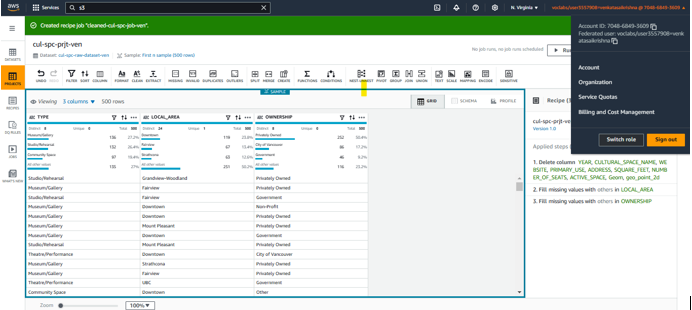

# **Project-1: Exploratory Data Analytics Platform Design and Implementation**

---

## **Project Title**
**Cultural Spaces Analytics Platform**

---

## **Project Description**
This project focuses on designing and implementing a **Data Analytics Platform (DAP)** to analyze cultural spaces in various local areas. The primary objectives are:  
- Identifying the number of cultural spaces in each local area.  
- Calculating the percentage of cultural spaces by ownership type:  
  - **Privately Owned**  
  - **Government-Owned**  
  - **Non-Profit**  

The platform leverages **AWS Services**, including **S3**, **Glue DataBrew**, and **Glue ETL**, to facilitate efficient data storage, profiling, cleaning, and transformation.  

---

## **Dataset Details**
Dataset: https://opendata.vancouver.ca/explore/dataset/cultural-spaces/table/?disjunctive.type&disjunctive.primary_use&disjunctive.ownership
The dataset used for analysis includes the following columns:  
- **YEAR**: Year of data collection.  
- **CULTURAL_SPACE_NAME**: Name of the cultural space.  
- **WEBSITE**: Official website of the cultural space.  
- **TYPE**: Type of cultural space (e.g., theater, museum).  
- **PRIMARY_USE**: Primary use of the cultural space.  
- **ADDRESS**: Full address of the cultural space.  
- **LOCAL_AREA**: Local area where the cultural space is located.  
- **OWNERSHIP**: Ownership type (e.g., Private, Government, Non-Profit).  
- **SQUARE_FEET**: Total area of the cultural space in square feet.  
- **NUMBER_OF_SEATS**: Number of seats available in the cultural space.  
- **ACTIVE_SPACE**: Indicates whether the space is actively used.  
- **Geom**: Geometric data of the cultural space (e.g., boundary information).  
- **geo_point_2d**: Latitude and longitude of the cultural space.  

---

## **Methodology**

### **1. Data Ingestion**
Data is ingested into AWS S3 buckets:  
- **Bucket 1:** `cul-spc-raw-ven` for storing raw data.  
- **Bucket 2:** `cul-spc-trf-ven` for storing transformed data, organized into subfolders such as:  
  - `data-profiling`  
  - `data-cleaning`  
  - `data-quality`  

These structured buckets ensure proper data organization and accessibility.  

  
*Screenshot of storage buckets in AWS Console.*  

---

### **2. Data Profiling**
AWS Glue DataBrew simplifies profiling by:  
- Connecting directly to the raw dataset.  
- Running profiling jobs to identify:  
  - Missing values  
  - Correlations  
  - Invalid data  
  - Overall data quality  

**Key insights from the profiling process:**  
- **Missing Data:** Approximately 11% missing values in some columns.  
- **Critical Columns Identified:** **TYPE**, **LOCAL_AREA**, and **OWNERSHIP**.  

  
*Connection of the raw dataset in AWS DataBrew.*  

  
*Analysis of missing values in the dataset.*  

---

### **3. Data Cleaning**
The data cleaning phase involves the following steps:  
- Removing irrelevant columns while retaining critical data.  
- Addressing missing values (<1% in "LOCATION" and "OWNERSHIP").  
- Organizing cleaned data into the following formats:  
  - `system-folder` (Parquet format)  
  - `user-folder` (CSV format)  

  
*Final cleaned dataset in AWS DataBrew.*  

---

### **4. Data Pipeline Design**
An **AWS Glue ETL pipeline** was built to:  
- Transform the cleaned dataset.  
- Group data by location to analyze:  
  - Ownership distribution (Private, Government, Non-Profit).  
  - Concentration of cultural spaces in each local area.  

  
*AWS Glue ETL pipeline for transformations.*  

---

## **Tools and Technologies**
- **AWS Services:**  
  - S3: For data storage.  
  - Glue DataBrew: For data profiling and cleaning.  
  - Glue ETL: For data transformation.  
- **Programming Language:**  
  - SQL: For querying datasets.  
- **Others:**  
  - AWS Console for management and visualization.  

---

## **Deliverables**
1. **Ownership Distribution Analysis:**  
   Insights into ownership percentages (Private, Government, Non-Profit).  
     

2. **Local Area Analysis:**  
   Visualization of cultural spaces concentrated in each area.  
     

3. **ETL Pipeline:**  
   Efficient and repeatable workflow for future datasets.  
     

---

## **Conclusion**
The Cultural Spaces Analytics Platform efficiently manages cultural space data, offering actionable insights into ownership and geographic distribution. The modular design and use of AWS services ensure scalability, reliability, and performance for future analyses.  

---
